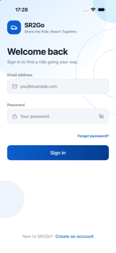
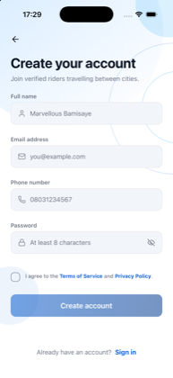
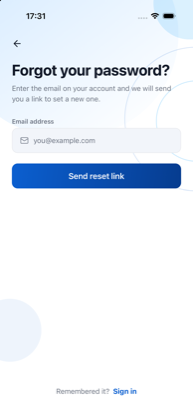
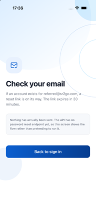
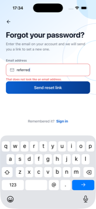
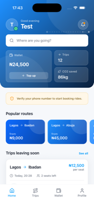
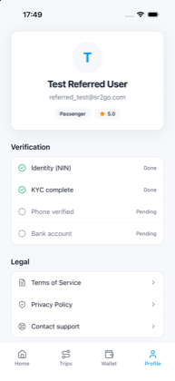
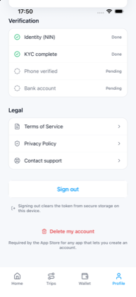
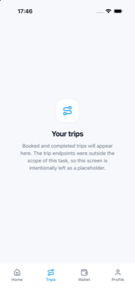
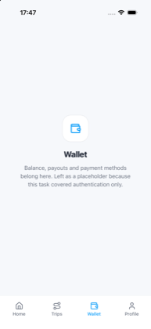

# SR2Go Mobile

A phone app for SR2Go, built as the technical task.

You open it, sign in with your email and password, and you land on a home
screen with your own name on it. Close the app and come back and you are still
signed in.

It is one app that runs on both iPhone and Android, built with React Native.

## What I was asked for

> Build a login screen in React Native that calls our live API endpoint
> `POST /api/auth/login` with email and password, handles the JWT token
> response, and navigates to a basic home screen on success.

In plain terms: build a sign in screen, connect it to the SR2Go server, and
send the user to a home screen once they are in.

That all works. I built the rest of the sign in journey too, because a single
login screen cannot really show the difficult part. The difficult part is what
happens afterwards: staying signed in, signing out properly, and behaving
sensibly when something goes wrong.

## What it does

- **Opening screen** that checks whether you are already signed in
- **Sign in** with email and password
- **Create an account**, including agreeing to the terms
- **Forgot password**, with a note explaining it is not connected yet
- **Home screen** showing your real name and account status
- **Trip details**, by tapping any trip
- **Your profile**, with your real account details, sign out, and delete account
- **Stays signed in** after you close and reopen the app

## The screens

All twelve taken from the finished app running on an iPhone, signed in with the
test account.

### Getting in

| Opening screen | Sign in | Create account |
|---|---|---|
|  |  |  |
| Shown for just over two seconds while the app checks if you are already signed in. It keeps moving, so a slow connection never looks like the app has frozen. | The boxes are empty here. While I am working on the app they fill in the test account automatically, but the real app never does that. | The button stays greyed out until you tick the box agreeing to the terms. Both app stores require that. |

| Forgot password | Link sent | When you type something wrong |
|---|---|---|
|  |  |  |
| A sign in screen with no way out when you forget your password is a dead end, so the screen is here even though the server cannot send the email yet. | What you would see if it worked, plus an honest note that nothing was actually sent. | The message appears under the box it belongs to, and the space is always there, so the form never jumps around as you type. |

### Once you are signed in

| Home | Trip details |
|---|---|
|  |  |
| Your name, the blue tick and the orange reminder are all real, pulled from the SR2Go server. The trips themselves are example data. Behind the header there is a dotted route line with a small marker travelling along it. | Opens on top of the home screen so the buttons along the bottom stay where they are. The booking button is greyed out and explains why. |

| Profile | Deleting your account | Trips | Wallet |
|---|---|---|---|
|  |  |  |  |
| Everything on this page is real: your name, email, account type, rating and all four verification steps. | Links to the terms and privacy policy, and a way to delete your account. Both stores insist on these. | Explains what the page is for instead of showing an empty screen. | Same. |

## Running it yourself

You need Node 20 or newer, and either Xcode (for iPhone) or Android Studio.

```bash
npm install
cp .env.example .env     # then add the test email and password
npx expo run:ios         # or: npx expo run:android
```

The app talks to `https://shareride2go.com`.

The `.env` file holds the test account so you do not have to type it every
time. It is deliberately not included in this repository. Login details do not
belong in shared code, even test ones.

## How the code is organised

```
src/
  api/          the only part that talks to the server, and where the login is kept
  components/   reusable pieces: buttons, text boxes, cards
  context/      keeps track of who is signed in
  hooks/        shared behaviour used by more than one screen
  navigation/   which screens exist and how you move between them
  screens/      one file per screen
  theme/        colours, spacing and text sizes, all in one place
  utils/        checking what people type, and formatting money and dates
```

The idea is that each screen only describes what it looks like. None of them
deal with the server directly. They ask for something by name and get back
either the answer or a clear, readable error. So if the server changes, one
folder changes and the screens do not.

## Things I decided, and why

### The sign in screen is white, not dark

It started out dark blue and it looked good. Then I measured it.

There is an international standard for how readable text has to be against its
background. It is a ratio, and 4.5 is the minimum for normal text. The faint
grey hint text inside the boxes measured **2.28** against the dark blue, which
means people with weaker eyesight would struggle to read it. On white, the same
grey measures **4.54** and passes.

Two other problems turned up once I started measuring:

- The SR2Go marketing blue measures **3.03** on white, so it is too light to
  use for words. There is now a slightly darker blue for anything you actually
  have to read. The bright blue is still used, just for filling shapes.
- The white writing on the sign in button measured **2.51** at the light end of
  the button. That one was there from the start. The button is darker now and
  the writing is readable across the whole of it.

The brand colour did not disappear. It moved into the shapes behind the
content, where nothing has to be read on top of it.

### Your login is kept where the phone keeps passwords

When you sign in, the server gives the app a small pass that proves it is you.
The app has to keep that somewhere.

It goes into the phone's own secure storage: the Keychain on iPhone, and the
encrypted equivalent on Android. Both are protected by the phone itself.

The easier option would have been ordinary app storage, which is just a file.
On a phone that has been tampered with, anyone can read that file. A login pass
is as good as a password, so it belongs behind the phone's own protection.

Signing out deletes it, so nothing is left behind.

### The app waits 30 seconds before giving up

The first sign in of the day took **9.7 seconds** to come back. Later ones were
quick, so it looks like the server takes a moment to wake up.

Most apps give up after 10 seconds. That would have turned a slow success into
a failure the user can do nothing about.

So the app waits longer, and the screen explains itself while it waits: the
button spins, it stops responding so nobody presses it twice and sends the
server two requests, and a line appears underneath saying it can take a few
seconds.

A nine second wait you understand is annoying. A nine second wait that looks
like the app has crashed makes people delete it.

### Signing in does not "go to" the home screen

This sounds like hair splitting and it is not.

Instead of the sign in screen sending you to the home screen, the app looks at
whether anyone is signed in and shows the matching half of the app. When you
are signed out, the signed in screens do not exist at all.

The practical result is that you cannot get back into someone's account with
the back gesture after signing out, which is a real bug in a lot of apps.

### The app can never get stuck on the opening screen

Reading from the phone's secure storage can fail. If the app does not expect
that, it sits on the opening screen forever and the only fix is deleting the
app.

Every possible outcome of that check ends with a decision: signed in, or signed
out. The worst case is being asked to sign in again, which is a minor
inconvenience rather than a dead end.

## What the app stores require

Apple and Google both reject apps that miss these, so they are built in:

- **Agreeing to the terms when you create an account**, as a box you tick
  yourself, not one already ticked for you
- **Links to the terms and privacy policy**, on the sign up screen and in your
  profile
- **Deleting your account from inside the app.** Apple requires that any app
  letting you create an account also lets you delete it, and rejects apps that
  tell you to email support instead. The screen and the two step confirmation
  are built. The server cannot actually delete accounts yet, and the app says
  so rather than pretending.

## Security check

I went looking for problems before sending this, not after. I found one real
one, in my own work, and fixed it.

### Login details were hidden in the app itself

To save typing, the sign in boxes were filled in automatically from a settings
file holding the test account. That file is deliberately kept out of this
repository, so it felt safe.

It was not. That kind of setting gets copied into the app when the app is
built. I checked by searching the finished app file, and found:

```
FOUND IN BUNDLE: Test@1234567
FOUND IN BUNDLE: referred_test@sr2go.com
```

The password was sitting in plain text inside the app. Anyone who downloaded
it could have read it. Keeping the file out of the repository protected the
code and did nothing at all for the app people install.

The automatic filling in now only happens while I am working on the app. The
finished version ignores it completely. I rebuilt and checked again:

```
gone from bundle: Test@1234567
gone from bundle: referred_test@sr2go.com
```

The sign in screenshot near the top shows the same thing from the other side:
the boxes are empty.

### Everything else I checked

| What I checked | What I found |
|---|---|
| Login details saved in the code history | None. That file was never included |
| Connection to the server | Always encrypted. Nothing sent over an open connection |
| Where your login pass is sent | Only ever to SR2Go, never anywhere else |
| Login details written into logs | None. Logging is switched off entirely in the finished app |
| Links the app can open | Only the terms, privacy and support pages, all fixed in the code |
| Outside code the app depends on | 10 minor warnings, all in build tools. None of it ends up in the app |

One thing SR2Go's server does well: a wrong password and an email that does not
exist give exactly the same message. That stops anyone using the login screen
to work out who has an account.

### Making it usable for everyone

I measured the readability of the text rather than trusting my eyes, and found
three places that fell below the standard:

| | Before | After |
|---|---|---|
| Hint text inside the boxes | 2.28 | 4.54 |
| Brand blue used as writing | 3.03 | 5.90 |
| White writing on the main button | 2.51 | 5.90 to 10.24 |

Anything at 4.5 or above passes. The last one was in the design from the start.

Three links were also not being announced properly by the screen reader that
blind users rely on, so they were read out as ordinary text rather than as
things you can tap. And the Top up button was smaller than the minimum size a
finger can reliably hit. Both fixed.

## What is real, and what is example data

The task was about signing in. The trips, wallet and booking parts of the
server were not included, so:

- The trips on the home screen are example data, kept in one file and shaped
  exactly the way the real ones would arrive. Connecting the real thing is a
  one line change.
- The Trips and Wallet tabs explain what they are for instead of showing a
  blank screen or made up numbers.
- The booking button is visibly greyed out and says what it needs.

Everything that comes from the server is genuine: your name, email, account
type, rating and all four verification steps on the profile screen.

## The server, as I found it

There is no written documentation for the server, so I worked out what it
expects by trying it:

| What it does | What you send | What comes back |
|---|---|---|
| `POST /api/auth/login` | email, password | a login pass, a renewal pass, your name, account type and verification status |
| `POST /api/auth/register` | full name, email, phone, password | the same as login |
| `POST /api/auth/refresh` | the renewal pass | the same as login |
| `GET /api/auth/me` | your login pass | your full account details |

Errors arrive in two different shapes: a single sentence for something like a
wrong password, and a list of specific problems when something you typed was
not valid. The app understands both, and puts each problem underneath the box
it belongs to rather than showing one vague message at the top.

## What I would do next

- **Renew the login pass automatically.** The server offers this and the app is
  ready for it, but does not use it yet. At the moment an expired pass means
  signing in again.
- **Tell a lost connection apart from a rejected login.** Right now any failure
  while the app is starting signs you out. Losing signal should not do that.
- **Real trips**, once those parts of the server are available.
- **Automated tests**, starting with the code that checks what people type and
  the code that turns server errors into readable messages.
- **Phone verification**, since the server already reports whether it is done
  and the home screen already asks for it.
- **A working forgot password**, once the server can send the email.
